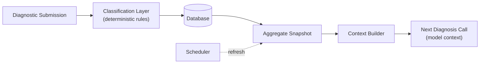

# The Data Flywheel

**Date:** May 3, 2026

## What It Is

A self-sharpening diagnostic mechanism. Every completed diagnostic feeds a population aggregate. Every new diagnostic reads from that aggregate before generating its output. The dataset is not a reporting layer — it is a runtime input.

## Why It Matters

A platform with one diagnostic in the dataset should not produce the same output as a platform with one thousand. The flywheel makes the dataset itself a first-class part of every output. Diagnostic quality scales with volume automatically; nothing has to be re-prompted, retrained, or re-deployed for the next submission to benefit from the prior one.

## How It Works

A submission is classified the moment it lands. The classification result is written alongside the raw answers. On a fixed schedule, the aggregate snapshot is rebuilt from the database — a single SQL function does the entire computation. Every subsequent diagnosis call reads the latest snapshot via the context builder and grounds its output in real population data.

## Three Layers

1. **Classification.** Deterministic rules score each submission across a set of positioning dimensions. Each dimension answer maps to one of three known signal levels. Aggregated counts produce a misalignment score; a fixed rule order assigns the cluster. No model is invoked, no inference cost is incurred, the result is fully reproducible.

2. **Aggregation.** A scheduled function rebuilds the population snapshot. Distribution by cluster, average misalignment, top positioning gaps, and dominant blocking factors are recomputed on a fixed cadence. The aggregate is a single row at v1 — a global snapshot of the entire diagnosed population.

3. **Injection.** Every diagnosis call reads the latest snapshot from the database and injects it into the model's context window before generating output. The model produces prose; the prose references real numbers from real submissions. Population context turns a solo diagnostic into intelligence.

## Build Decisions

- **Deterministic classification, not model-based.** Rules are auditable, reproducible, and free of inference cost. A submission's archetype assignment can be traced back to specific rule matches. Tunable without retraining.
- **Single-row aggregate for v1.** Multi-segment aggregation (industry × region × experience) is a future build. At current data volume it would slice the dataset thinner than the signal warrants.
- **Empty-table fallback.** If the aggregate has not yet refreshed, diagnoses ship without injection rather than fail. Silent degradation, no fabricated stats. The next refresh restores grounded output automatically.
- **Database-native scheduler.** The refresh is pure SQL, scheduled inside the database itself. Adding an external orchestration tool was unnecessary surface area at this scale.
- **Refresh every six hours.** Tightens to hourly when submission volume warrants it. The cadence is a config change, not a code change.

## What This Unlocks

Every future diagnostic submission improves the next one. The asset grows automatically. Volume becomes the only variable. The dataset compounds in two directions at once: it grows in size with every submission, and its grounding effect on subsequent diagnoses tightens with every refresh.

---

© 2026 Marquise Jones. All rights reserved.
