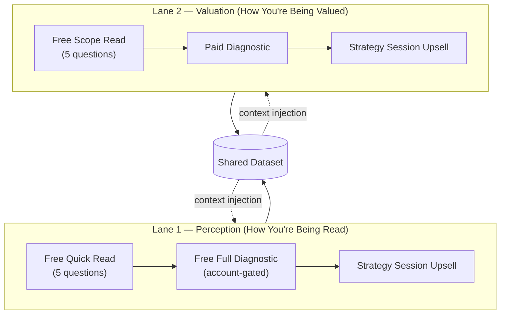

# Dual-Lane Funnel

**Date:** May 3, 2026
**Status:** Superseded by [single-funnel.md](./single-funnel.md) (V44, May 2026). Preserved as historical reference for the V42-era architecture. The active platform no longer operates a dual-lane offer stack; both diagnostic axes still feed the same dataset, but the paid surfaces described below have been retired. See [build-log/v44-funnel-collapse.md](../build-log/v44-funnel-collapse.md) for the reasoning.

## What It Is

Two parallel diagnostic lanes feeding one shared dataset. The first lane reads how a professional is being perceived by hiring systems. The second lane reads whether their scope and title are aligned in the market. Each lane operates independently end-to-end — own free entry quiz, own paid product, own strategy session upsell — but both lanes write into the same dataset and consume from the same aggregate.

## Why Two Lanes

Both axes matter independently. A professional can be read correctly and still be valued incorrectly. A professional can be valued correctly by their employer and still be misread by the broader market. Diagnosing one axis without the other left half of the buyer's actual problem unaddressed.

## Architecture

A buyer entering through one lane sees the existence of the other on every completion page. Cross-lane CTAs are wired across all four diagnostic exits.

## Shared Infrastructure

What both lanes share, with no duplication between them:

- The authentication layer.
- The dashboard view that surfaces a buyer's results across both axes.
- The dataset aggregate (one snapshot per lane, both pulled by a single context builder).
- The context injection mechanism that grounds every diagnosis call.
- The owner alert layer.

## Distinct Infrastructure

What is lane-specific by design:

- Classification rules. Each lane reads a different set of signal dimensions; the rules that turn submissions into cluster assignments are not shared between lanes.
- Aggregate snapshots. Each lane keeps its own population snapshot; the context builder pulls both in parallel and combines them in the model's context window.
- Payment products. One strategy session product per lane, each carrying lane-specific metadata for downstream analytics.
- Landing pages and offer framing. The two lanes describe structurally different problems and require structurally different copy.

## Build Decisions

- **Free entry for both lanes.** The diagnostic itself is a dataset feeder, not a revenue tier. Pricing the diagnostic gated the asset that matters most to the platform.
- **Account creation as currency on the larger free diagnostic.** The full perception diagnostic is free in exchange for sign-up — captures email, creates a relationship that compounds, and converts the diagnostic from a one-time output into an ongoing surface.
- **Two strategy session products, not one.** Lane-specific upsells preserve metadata for downstream analytics, keep webhook routing clean, and prevent one lane's pricing or framing changes from constraining the other.
- **Live aggregate stats on the public homepage.** The platform references its own dataset as the basis for its public claims. Smaller numbers, sharper claims. Honest framing beats round-number framing.
- **Cross-lane CTAs at every diagnostic exit.** A buyer entering through one lane is shown the other lane on the completion page. The platform makes both diagnoses discoverable in one session.

## Outcome

The platform now operates two diagnostic entry points feeding one dataset, with clean separation between the read-correctly axis and the valued-correctly axis. The dataset compounds across both lanes simultaneously.

---

© 2026 Marquise Jones. All rights reserved.
