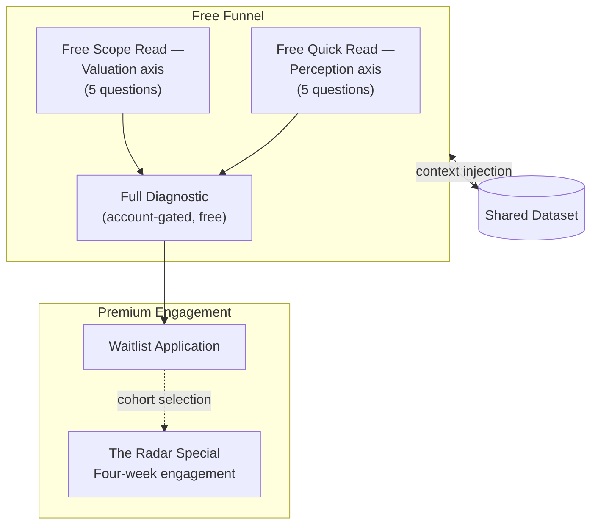

# Single-Funnel Architecture

**Date:** May 2026
**Supersedes:** [dual-lane-funnel.md](./dual-lane-funnel.md) (V42)

## What It Is

A single funnel feeding one premium engagement. Two free entry points lead into one free terminal diagnostic. A single director-tier engagement sits above the free stack, gated by waitlist.

## Architecture

A buyer entering through either free quiz sees the other axis on their results page. The terminal diagnostic is reachable from both quizzes and from the dashboard. The premium engagement is reachable from the terminal diagnostic's results page and from the homepage; access is by waitlist only.

## Shared Infrastructure

What every layer shares, with no duplication:

- The authentication layer.
- The dashboard view that surfaces results across both diagnostic axes.
- The dataset aggregate (one snapshot per axis, both pulled by a single context builder).
- The context injection mechanism that grounds every diagnosis call.
- The owner alert layer.

## Distinct Infrastructure

What is axis-specific by design:

- Classification rules. Each axis reads a different set of signal dimensions; the rules that turn submissions into cluster assignments are not shared across axes.
- Aggregate snapshots. Each axis keeps its own population snapshot; the context builder pulls both in parallel and combines them in the model's context window.
- Landing pages and result framing. The two axes describe structurally different problems and require structurally different copy.

## The Premium Engagement Surface

The premium engagement has a single sales surface with the following architecture:

- An outcome promise framed at the level the engagement actually operates.
- An identity filter that names the buyer the engagement is built for and signals out buyers it is not built for.
- A four-week engagement structure laid out as four sequential commitments.
- A price reveal positioned as a confidence frame against the asymmetric upside of repositioning at the engagement's target altitude.
- A stacked risk-reversal layer.
- A capacity statement that constrains availability.
- A waitlist application that captures contact information and routes to the operator directly.

The page does not list testimonials, badges, or feature comparisons. The framing is restraint: premium offers are confident, not exhaustive.

## Build Decisions

- **One paid surface, not five.** Volume in the prior dual-lane stack did not justify operational overhead per product. Consolidating into a single premium engagement positioned at the engagement's actual leverage altitude removes the in-between tiers without losing the revenue surface.
- **Waitlist as the only access path.** The engagement is delivered by one operator in calendar time against a buyer's actual market position. Open checkout would create a routing problem the engagement cannot scale through. The waitlist filters at the application step rather than at the payment step.
- **Capacity as a load-bearing constraint, not a marketing claim.** Cohorts are capped because the work cannot be delivered above a certain concurrent count. The constraint is structural, not artificial scarcity.
- **The dashboard stops pointing at paid surfaces.** With the dual-lane upsell tracker removed, the dashboard returns to a results display. A single director-tier callout sits above the result cards as the only paid-tier surface visible to a logged-in buyer.

## What Both Axes Still Share

The two diagnostic axes still operate as before. Both feed the same dataset. Both pull context from the same aggregate. The dashboard surfaces results from both. The change in V44 is what sits above the free funnel, not the free funnel itself.

## Outcome

The platform operates two free diagnostic entry points, one free terminal diagnostic, and one premium engagement. The dataset compounds across the free tier. The premium tier carries the line by itself.

---

© 2026 Marquise Jones. All rights reserved.
