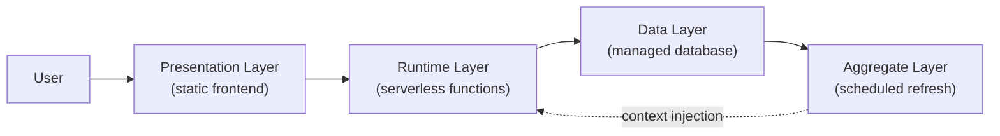

# Radar System Overview

**Date:** May 3, 2026

## What Radar Is

Radar is a two-axis diagnostic platform for senior IT professionals. The first axis reads how a professional is being perceived by hiring systems. The second axis reads whether their scope and title are aligned in the market. Each axis has its own free entry diagnostic, a paid product, and a strategy session upsell that sits above both. Both axes feed one shared dataset.

Every diagnosis the platform produces is grounded in real population data drawn from prior submissions. The dataset is a first-class component of the runtime — not a reporting concern. As the platform is used, every output sharpens. The platform does not coach. It diagnoses misalignment and surfaces the structural moves that close it.

## Architecture

Three layers compose the platform. The presentation layer is a static frontend served from a content delivery network. The runtime layer is a set of serverless functions invoked on demand. The data layer is a managed relational database with a separate aggregate snapshot kept fresh by a scheduled job.

The aggregate layer pulls a snapshot of the population dataset on a fixed schedule. Every diagnosis call reads the most recent snapshot and injects it into the model context before generating output. This is what grounds the platform's diagnoses in real data rather than training priors.

## Component Inventory

The platform is composed of seven distinct components, each with a well-defined boundary:

1. **Diagnostic entry points.** Two free quizzes and two paid diagnostics, one of each per lane. The free quizzes accept anonymous submissions; the paid diagnostics gate behind authentication.

2. **Authentication layer.** Magic-link and password sign-in with same-origin redirect handling. The authentication layer protects the paid diagnostics and the dashboard view.

3. **Classification layer.** Deterministic rules score each submission. No model in the loop. Classification produces a cluster assignment and a misalignment index per submission.

4. **Diagnosis generation.** Model-based, dataset-grounded prose output. The model is invoked once per submission with the population aggregate injected as context.

5. **Aggregation layer.** A scheduled job rebuilds the population snapshot. Distribution by cluster, average misalignment, top positioning gaps, and dominant blocking factors are recomputed on a fixed cadence.

6. **Payment processor integration.** Two paid diagnostic products and two strategy session products. Each product carries lane-specific metadata that survives the webhook into the platform's database.

7. **Owner alert layer.** Real-time notifications to the operator on every paid event and every diagnostic submission. Surfaces the platform's signal stream the moment it lands.

## What Lives Where

The platform's public surface is the static frontend served at `workforceradar.com`. Page weight stays light. Every interactive surface posts to one of the runtime functions, which talks to the data layer with a service role credential.

Production source code lives in a private repository. This repository contains the architecture writeups, decision records, methodology overviews, and build logs — the public-facing context. The two repositories are intentionally separated. The public repository explains how the platform is built; the private repository contains the implementation.

---

© 2026 Marquise Jones. All rights reserved.
