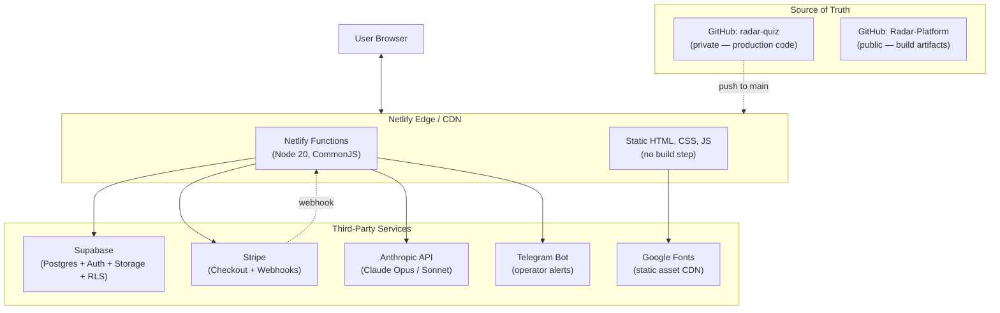
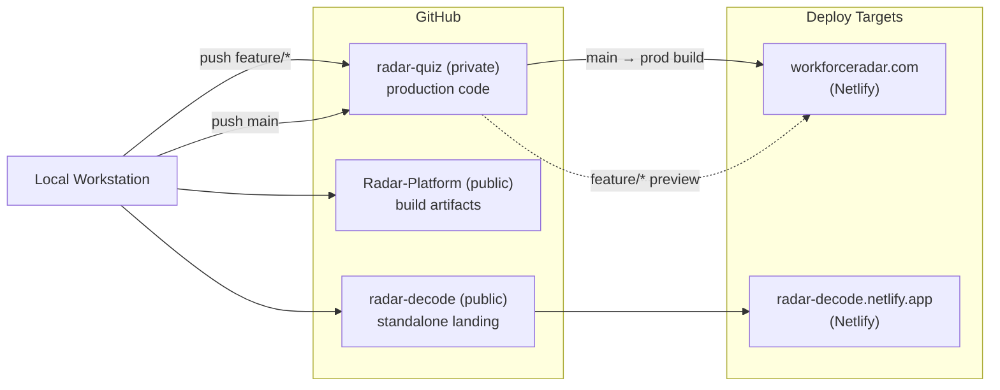

# Radar Tool Stack

**Date:** May 3, 2026

## What This Is

A vendor-by-vendor map of the Radar platform: which tools run which layer, how they talk to each other, and how the GitHub repositories connect to the deploy pipeline. Companion to [system-overview.md](./system-overview.md), which describes the architecture in abstract terms.

## Top-Level Diagram



The browser only ever talks to Netlify. Netlify serves static pages from its CDN and runs Functions on demand. Functions are the only layer that holds service-role credentials for Supabase, Stripe, Anthropic, and Telegram. Nothing privileged ships to the client.

## Layer Walk-Through

### Edge / Hosting — Netlify

Netlify owns three responsibilities:

1. **Static asset delivery** for every `.html`, `.css`, `.js`, `.svg`, and image file under the project root. Pages are pre-rendered HTML; no build step runs on deploy.
2. **Netlify Functions** for every server-side action: checkout creation, webhook ingestion, diagnosis generation, magic-link minting, dashboard data reads, owner alert dispatch.
3. **Branch-deploy preview URLs** for every push to a feature branch — the audit surface before a production cut.

Routing is path-based. `/api/*` resolves to a function of the matching name; everything else is a static file.

### Frontend — Vanilla HTML / CSS / JS

No framework, no bundler, no transpile step. Each page is a self-contained `index.html` with inline `<style>` and `<script>` blocks plus a small set of shared global scripts (`/js/v43-globals.js`, `/js/v43-page-transition.js`, `/js/error-reporter.js`, `/js/support-widget.js`).

Runtime libraries load via CDN script tags rather than npm:

- **Lenis** — smooth scroll, marketing pages only
- **GSAP + ScrollTrigger** — entry animations on marketing pages
- **No client-side framework** — every page is a flat document

The two-stylesheet design system (`/styles/tokens.css`, `/styles/animations.css`) is canonical. Color, spacing, duration, and easing all flow through 27 CSS custom properties documented in `/docs/design-system.md` (private repo).

Operator surfaces (the dashboard and login) intentionally skip Lenis, GSAP entries, and the signal-pulse component. The split between marketing and operator visual modes is enforced by an `OPERATOR_PATHS` allowlist in the global init script.

### Backend — Netlify Functions

Roughly fifty functions, grouped by domain:

- **Auth** — magic-link request, password sign-in, session refresh
- **Diagnostic intake** — quiz submission, RDS submission, scope submission
- **Diagnosis generation** — Anthropic invocation with population context injection
- **Payments** — Stripe Checkout session creation, webhook ingestion, order recording
- **Dashboard reads** — joined queries across the submission and order tables
- **Alerts** — Telegram dispatch on every paid event and every diagnostic submission

Each function holds its own service-role credentials via Netlify environment variables. The browser never sees them.

### Data — Supabase

A single Postgres instance with around forty tables. Three sub-systems share it:

1. **Auth.** Supabase's built-in user table plus magic-link issuance.
2. **Submissions and orders.** Lead capture, free quiz answers, paid diagnostic answers, paid order records, strategy session bookings.
3. **Aggregate snapshot.** Two materialized aggregate rows refreshed on a fixed schedule by `pg_cron` — one per diagnostic lane. Diagnosis calls read the latest snapshot before invoking Anthropic.

Row-level security is on for every table the browser can reach. Service-role access from Functions bypasses RLS where needed; the browser uses the anon key and is constrained by policy.

### AI — Anthropic API

Claude Opus and Sonnet are invoked from a single diagnosis function per lane. The function:

1. Reads the submission row.
2. Reads the latest aggregate snapshot.
3. Constructs a prompt that grounds the model in real population data.
4. Streams the response back to the database.
5. Marks the row as ready and triggers an operator alert.

If the aggregate has not yet refreshed, diagnosis ships without injection rather than fabricating stats. Silent degradation by design.

### Payments — Stripe

Three product tiers, each with its own Checkout session creator:

- The entry-tier paid diagnostic
- The Read product
- The strategy session (two SKUs — one per lane)

A single webhook function handles every paid event. Lane metadata is stamped onto the Checkout session at creation time and survives the webhook into the database, so the right lane's intake or fulfillment fires regardless of which SKU was bought.

Live and test modes are separated by environment variable; both flow through the same function code.

### Alerts — Telegram

A single bot, two destination chats. Every diagnostic submission and every paid event fires a message within seconds of landing in the database. The owner watches the platform's signal stream in real time without ever opening the dashboard.

### Fonts — Google Fonts

Four families, served via the standard `fonts.googleapis.com` stylesheet link with `preconnect` hints:

- **Bebas Neue** — display headings
- **IBM Plex Sans** — body
- **Cormorant Garamond Italic** — editorial accent (marketing only)
- **DM Mono** — operator metadata, eyebrows, status text

Self-hosting was considered and skipped. CDN delivery is faster for a first-time visitor and cheaper to maintain than a font-pipeline step.

## GitHub Integration



### Two Repos, Two Purposes

- **`radar-quiz` (private).** Production HTML, CSS, JS, Functions, design tokens, prompt templates, classification rules. Deployed to `workforceradar.com` on every push to `main`.
- **`Radar-Platform` (public).** Architecture writeups, decision records, methodology, design-system documentation, build logs. The repository this file lives in. Documents how the platform is built without exposing the implementation.
- **`radar-decode` (public).** A standalone single-file landing for the Decode entry tier, deployed independently to `radar-decode.netlify.app` so distribution surges route directly to the lowest-friction offer.

The split is intentional. The public repos let the work be inspectable; the private repo is the actual codebase.

### Branch Model

`main` is always the deployed state of `workforceradar.com`. Phased rebuilds happen on a single named feature branch (`feature/v43-visual-rebuild`, `feature/v43.5-dashboard`) with audit pauses between phases. The branch ships in a single no-fast-forward merge to `main` after preview-deploy approval.

### Tag Convention

Every visual or structural cut gets an annotated tag at the merge commit: `v42.0`, `v43.0`, `v43.5`. The tag message captures what changed and why, separate from the commit log. Tags are pushed to GitHub and serve as the rollback target if a future cut needs to be reverted.

### Deploy Pipeline

```
local edit
   │
   ▼
git commit on feature branch
   │
   ▼
git push origin feature/<name>
   │
   ▼
Netlify branch-deploy preview URL fires
   │
   ▼
owner audits the preview
   │
   ▼ (approved)
no-ff merge to main
   │
   ▼
git push origin main
   │
   ▼
Netlify production build runs
   │
   ▼
prod smoke pass — pages, auth, payments, alerts
   │
   ▼
annotated tag pushed
```

No CI test suite gates the merge. The audit is human, the smoke pass is human, the cut is owner-approved every time.

### Environment & Secrets

Production secrets live in Netlify environment variables and are referenced by name in Function code. Nothing ships to the browser. Secrets in scope:

- Supabase service-role key, Supabase anon key, Supabase URL
- Stripe live secret, Stripe webhook secret, Stripe test secret
- Anthropic API key
- Telegram bot token, Telegram chat IDs
- Internal feature flags

Local development uses a `.env` file that is git-ignored. Rotation is manual; key compromise would mean rotating in Netlify and redeploying.

### Schema Migrations

Database changes are versioned migrations applied through Supabase's migration tooling. The migration history lives alongside the production code in the private repo. Aggregate refresh logic lives inside the database as SQL functions invoked by the scheduler — not as application code.

## Key Non-Obvious Integrations

A handful of integrations are not visible from the architecture diagram but are load-bearing:

- **Free-to-paid claim flow.** A free quiz submission writes a lead row keyed by email. When the user later buys the paid diagnostic, the webhook claims the orphan lead and joins it to the paid order. One identity across the funnel.
- **Session-id round-trip.** A paid Stripe session writes its `session_id` into the order row at creation. The post-payment intake form posts that same `session_id` back, which is how the intake gets joined to the right paid order without a separate user account.
- **Magic-link with `?next=` parameter.** The auth function accepts a `next` query parameter so that magic-link recipients land directly on the page they were trying to reach (typically the dashboard) rather than a generic landing.
- **Tester bypass.** A `localStorage` flag bypasses certain gating during owner testing so the production funnel can be walked end-to-end without consuming live Stripe events.
- **Aggregate refresh cadence.** The aggregate snapshot is rebuilt every six hours by a scheduled SQL job. Diagnosis quality is bounded by snapshot freshness, not by submission rate.
- **Dashboard data joins.** The owner dashboard queries multiple submission and order tables in parallel and reconciles them client-side into a single per-user funnel view. The reconciliation logic is the dashboard's single biggest piece of frontend code.

## Quick Reference

| Question | Answer |
|---|---|
| Who serves the static site? | Netlify Edge / CDN |
| Who runs the server logic? | Netlify Functions (Node 20, CommonJS) |
| Where does data live? | Supabase Postgres |
| Who handles auth? | Supabase Auth (magic link + password) |
| Who handles payments? | Stripe Checkout + webhooks |
| Who generates diagnoses? | Anthropic API (Claude Opus / Sonnet) |
| Who notifies the operator? | Telegram bot |
| Where is production code? | `radar-quiz` (private GitHub) |
| Where are public artifacts? | `Radar-Platform` (this repo) |
| What is `main` always equal to? | The deployed state of `workforceradar.com` |
| What gates a production cut? | Branch-deploy preview + owner audit + smoke pass |

---

© 2026 Marquise Jones. All rights reserved.
