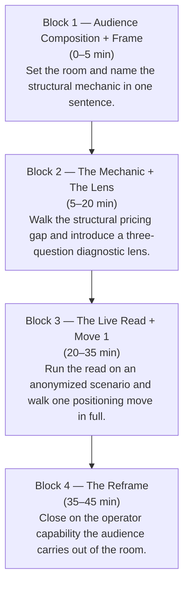
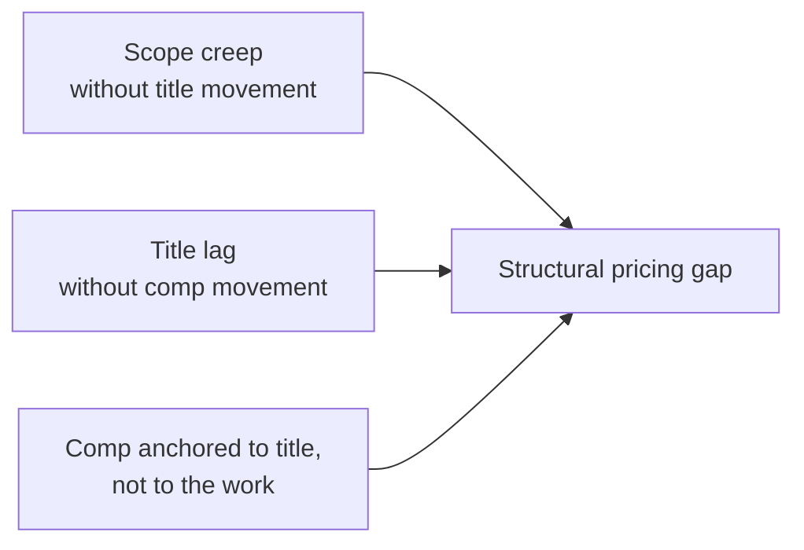
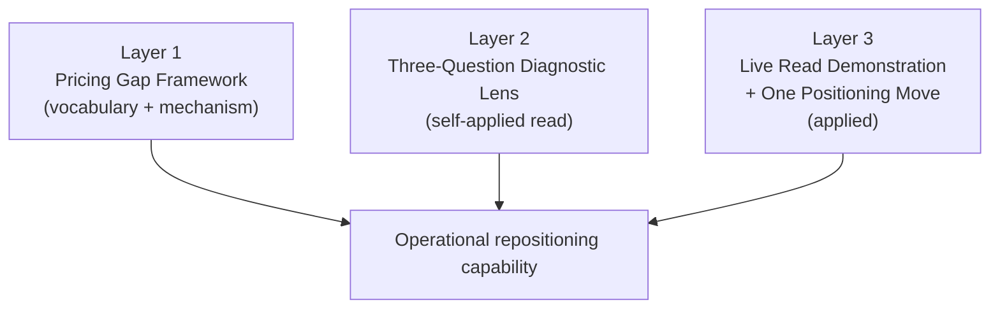

# The Underprice Read

**Date:** May 5, 2026

## Live Diagnostic Session Architecture

**Event Date:** May 8, 2026
**Duration:** 45 minutes
**Format:** Live, free, public diagnostic

## Session Thesis

Skilled technical operators underprice themselves at structural rates the market never corrects on its own. The mechanic is not psychological. It is mechanical. Scope expands without title movement. Title lags without comp movement. Comp anchors to title rather than to the work being done. The compound output is a structural pricing gap that is visible from the outside and invisible from the inside. A trained read can name the gap on a single profile in under five minutes. The same operator cannot name it on themselves, because the read requires reference data they do not carry. This session runs that read on a live audience.

## Audience Composition

The session is built for the audience composition documented across recent Radar engagement: mid-career individual contributors as the dominant segment, a meaningful weight of senior individual contributors, a smaller manager-and-lead segment, and cross-functional spread across infrastructure, security, data, and platform disciplines. Architecture and pacing reflect that composition rather than a generic professional audience.

## Session Architecture

The four blocks carry an explicit time budget. Frame in Block 1 is calibrated to the audience composition. Block 2 establishes shared vocabulary before any read is attempted. Block 3 is the demonstration: the diagnostic surface, then the positioning surface. Block 4 closes on capability rather than on offer.

## The Pricing Gap Mechanic

The three components do not act in isolation. Each one feeds the next. Scope creep without title movement gives the title-lag component a wider gap to cover. Title lag without comp movement gives the comp-anchoring component a stale reference to anchor against. The compound effect is a single readable structural pricing gap that the market continues to honor because nothing in the operator's surfaces signals otherwise.

## Deliverable Layers

The three layers are designed to converge. The framework gives the audience the vocabulary to name what they are looking at. The lens gives them an instrument to point at their own surfaces. The demonstration shows the lens applied end-to-end, followed by one positioning move walked through in full so the audience leaves with a concrete artifact pattern, not just a concept.

## Why This Session Exists

A recent content cluster on the structural mechanics of the hiring system produced significant audience recognition across Radar's distribution surfaces. The pattern in the response was consistent: operators recognized the mechanic in their own situations the moment it was named. Recognition without diagnosis is the hardest position to operate from — the operator can feel the gap but cannot read it.

This live session is the public reveal of the diagnostic Radar runs in the field. The format is intentional. A 45-minute live read is the shortest surface that can carry the framework, the lens, the demonstration, and the reframe without compressing the read itself into something the audience cannot apply afterward.

## Operating Rigor Note

The session is delivered with the same architecture Radar uses on private engagements: documented audience composition driving structural choices, four-block session architecture with explicit time budgets, three deliverable layers designed to converge on a single operator capability, and a live read run against an anonymized scenario rather than a generic example. The session is public. The rigor behind it is the rigor applied behind the firewall.
